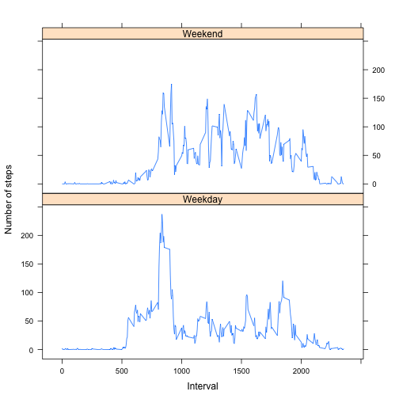

## Loading and preprocessing the data
The data was taken from the forked repository.

```r
unzip("activity.zip")
activity <- read.csv("activity.csv", as.is=TRUE)
activity$date <- as.Date(activity$date)
```


## What is mean total number of steps taken per day?

```r
totalStepsPerDay <- aggregate(activity$steps ~ activity$date, FUN=sum)
colnames(totalStepsPerDay) = c("Date", "Steps")
xlabel <- "Total number of steps taken each day"
hist(totalStepsPerDay$Steps, main = NA, xlab = xlabel)
```

 

```r
meanTotalStepsPerDay <- mean(totalStepsPerDay$Steps)
medianTotalStepsPerDay <- median(totalStepsPerDay$Steps)
```
The mean of total number of steps taken per day is: 10766.19.

The median of total number of steps taken per day is: 10765.

## What is the average daily activity pattern?

```r
# average number of steps taken per interval, averaged across all days
avgStepsPerInterval <- aggregate(activity$steps ~ activity$interval, FUN=mean)
colnames(avgStepsPerInterval) = c("interval", "steps")
plot(avgStepsPerInterval$interval, avgStepsPerInterval$steps, type = "l",
     xlab="Interval", ylab="Number of steps")
```

 

### Which 5-minute interval, on average across all the days in the dataset, contains the maximum number of steps?

```r
maxStepsLocation <- which.max(avgStepsPerInterval$steps)
maxInterval <- avgStepsPerInterval$interval[maxStepsLocation]
```
The 5-minute interval is 835.


## Imputing missing values

```r
totalNumberOfRowsWithNAs <- length(activity$steps[is.na(activity$steps)])
```
Total number of missing values is 2304.

**Missing values strategy**
We'll fill the missing values with the mean of the given internal for the same weekday.

```r
avgStepsPerIntervalPerWeekday <- aggregate(activity$steps ~ activity$interval + weekdays(activity$date),
                                           FUN=mean)
colnames(avgStepsPerIntervalPerWeekday) = c("interval", "weekday", "steps")
fabricateValue <- function(interval, weekday) {
    avgStepsPerIntervalPerWeekday$steps[
      avgStepsPerIntervalPerWeekday$interval == interval &
      avgStepsPerIntervalPerWeekday$weekday == weekday]
  }
```

Create a new dataset without missing values.

```r
activityFilled <- data.frame(activity$steps, activity$date, activity$interval)
colnames(activityFilled) = c("steps", "date", "interval")

naStepsIndices <- which(is.na(activityFilled$steps))

for (i in naStepsIndices) {
  interval <- activityFilled$interval[i]
  weekday <- weekdays(activityFilled$date[i])
  activityFilled$steps[i] <- fabricateValue(interval, weekday)
}
```

## Prepare and display histogram for new dataset.


```r
totalStepsPerDay <- aggregate(activityFilled$steps ~ activityFilled$date, FUN=sum)
colnames(totalStepsPerDay) = c("Date", "Steps")
xlabel <- "Total number of steps taken each day"
hist(totalStepsPerDay$Steps, main = NA, xlab = xlabel)
```

 

```r
meanTotalStepsPerDay <- mean(totalStepsPerDay$Steps)
medianTotalStepsPerDay <- median(totalStepsPerDay$Steps)
```
The mean of total number of steps taken per day is: 10821.21.

The median of total number of steps taken per day is: 11015.

Adding the missing values gave us different mean and median from the first part of the assignment. Adding missing values caused the total the estimates on the total daily nuber of steps to go up.


## Are there differences in activity patterns between weekdays and weekends?

```r
isWeekend <- function(date) {
    weekday <- weekdays(date)
    return (weekday == "Saturday" | weekday == "Sunday")
  }

activityFilled$dayType <- ifelse(isWeekend(activityFilled$date), "Weekend", "Weekday")

avgStepsPerInterval <- aggregate(activityFilled$steps ~ activityFilled$interval +   activityFilled$dayType,
  FUN=mean)

colnames(avgStepsPerInterval) = c("interval", "dayType","steps")
avgStepsPerInterval$dayType <- factor(avgStepsPerInterval$dayType)

library(lattice)
xyplot(steps ~ interval | dayType, data = avgStepsPerInterval, layout=c(1,2),
       type="l", xlab="Interval", ylab="Number of steps")
```

 
